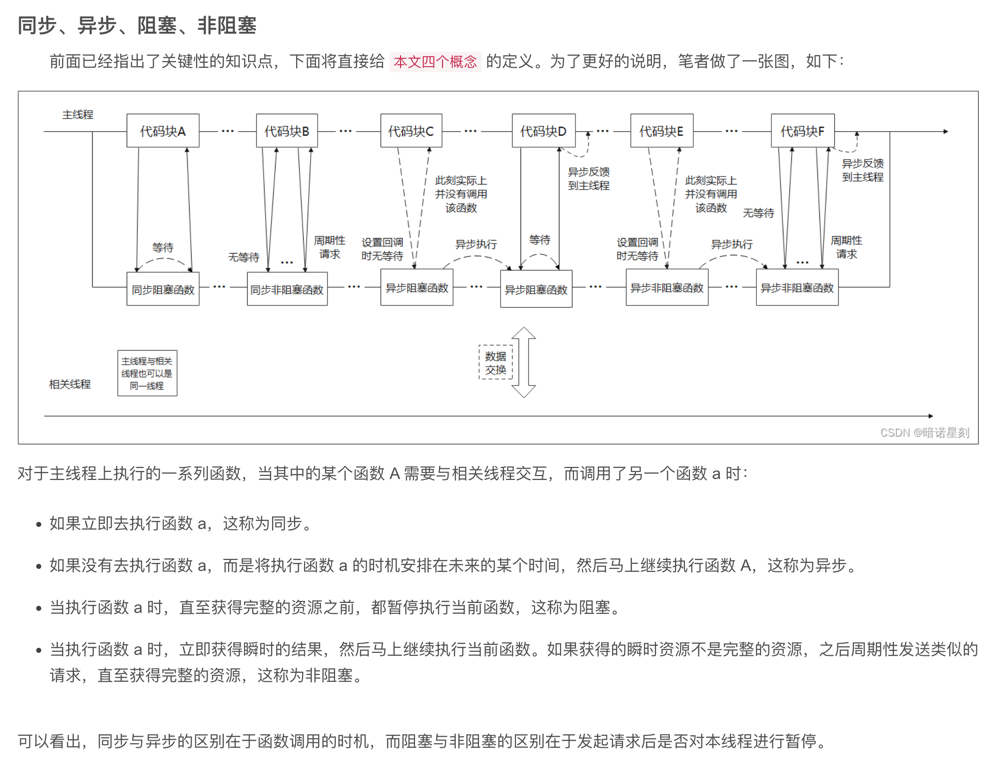

multiple thread experiences

# 同步、异步、阻塞、非阻塞

https://blog.csdn.net/wangpaiblog/article/details/117236684
* 客户端服务器的线程请求服务端主线程时，在底层是主线程函数对多个客户端线程的调用
* 同步和非同步
  * 客户端函数依次按照数据加载到服务端函数的函数待调用列表
  * 同步和非同步，取决于，在函数列表中的客户端函数是否按照列表次序依次执行
  * 对于客户端线程函数来说，如果待执行函数列表的执行顺序轮到自己，并且执行，则为同步，反之亦然
* 阻塞和非阻塞
  * 对于服务端主函数来说，当按照待执行函数表的顺序(类比代码顺序)，在执行某一个客户端线程函数时，因为处理io等资源，服务端函数无法处理其他客户端线程函数，而发生阻塞，对服务端主线程来说是阻塞，其他待执行的客户端线程函数在宏观上也是阻塞
  * 如果服务端函数，执行某一个客户端函数时，立即获得资源，并继续执行其他客户端线程函数；或者瞬时完成部分资源获取，后面通过回调等操作，周期性的完成所有资源的加载，服务端主线程在加载资源时，并未阻塞，则对于服务端线程函数来说是非阻塞
* 同步和异步，是以客户端线程为主体来说
* 阻塞和非阻塞，是以服务端线程函数为主体来说，既服务端线程函数，在处理某一客户端线程函数的过程中，在资源为完全加载完成时，是否具备继续处理其他客户端线程函数的能力，是否阻塞
  * 当然需要注意的是，当服务端线程函数因为调用某一个客户端线程函数，加载资源阻塞时，其他客户端线程是排队等待状态

